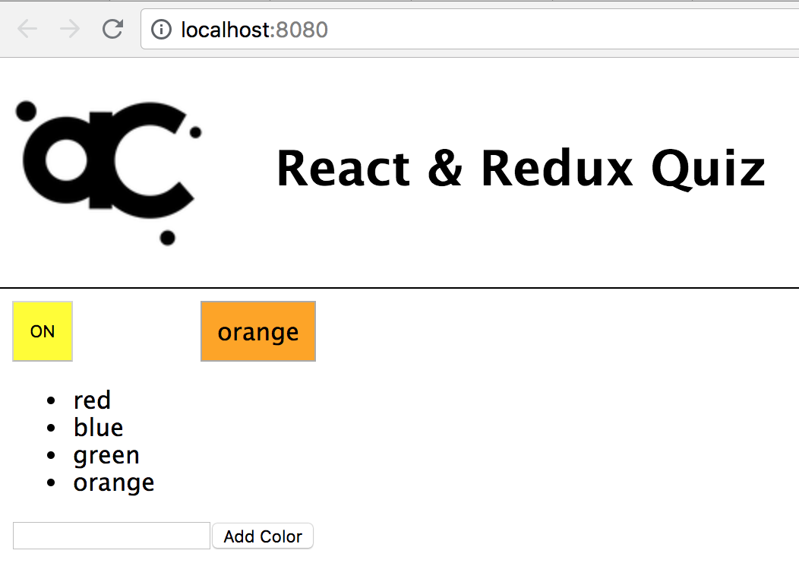

# React &amp; Redux Quiz

This quiz is designed to test your familiarity with basic React and Redux:

* State management with `redux` and `react-redux` (`connect` and `Provider`)
* State management with React (`this.state` and `this.setState()`)
* Components
* mapping Components
* props and prop types
* data down and events up

Follow the expect design specified.

## Submission requirement

* **Do a fork and PR like a normal lab**
* **Read the requirements more than once, it will save you a ton of time**

## Base Requirements

This is a rainbow lightbulb app. It has a color chooser and an on/off switch
that control the color of the bulb.

It might look like this:



Important to know:

* The project already has an `App.js`. **You should not modify this file**. You need to create the rest of the components as specified below
* You will need to setup redux including `store.js` (you do not need any middleware) and setting up the `<Provider>` component in `index.js`
* Follow the technical requirements and specifications below

## Components

* App
    * connect(RainbowLightBulb)
        * RainbowLightBulb
    * connect(ColorChooser)
        * ColorChooser
            * Color
            * AddColor

### Details

#### `RainbowLightBulb`

* Use `connect` to add prop `selectedColor` from `state` (`mapStateToProps`).
* Has it's own **local component state**:
    ```js
    state = {
        on: true
    }
* Renders:
    1. A `<button>` that toggles `on` state when clicked
    2. When `on` is true, a _conditionally rendered_ `<span>` element shows
    the color name and sets its `backgroundColor` style dynamically
    to the name of the color.

#### `ColorChooser`

* Use `connect` to
    * mapStateToProps - add props `selectedColor` and `colors` from `state` 
    * mapDispatchToProps - add action props `selectColor`, `loadColors`, and `addColor`
* In `componentDidMount`, call `loadColors` prop with an array of 3 colors of your choosing
* Renders:
    1. A list of `Color` components based on mapping the `colors` prop. Each
    `Color` component is also passed the `selectColor` prop.
    2. An `AddColor` component that is passed the `addColor` prop

#### `Color`

* Receives props `color` and `onSelect`
* Renders:
    1. Element (like `<span>`) with text set to `color` name, and when clicked calls `onSelect` prop with its `color`.


#### `AddColor`

* Receives prop `addColor`
* Has it's own **local component state**:
    ```js
    state = {
        color: ''
    }
* Renders:
    1. A `<form>` with 
        * an `<input>` for a color name bound to `color` state
        * a submit button
* On submit, the `addColor` prop is called with the `color` state

## Reducers

These need to include tests:

* `colors`
    * holds list of possible `string` color names to select
    * defaults to `[]`
    * actions: `COLORS_LOAD`, `COLORS_ADD`
* `selectedColor`
    * holds `string` name of the currently selected color
    * defaults to `'white'`
    * actions: `SELECT_COLOR`

### Action Creators

These also need to be tested:

* `selectColor` creates action to select supplied color
* `addColor` creates action to add supplied color to `colors` list
* `loadColors` creates action to load array of colors as the `colors` list

## Rules

1. Use standard lab process: fork this repo and clone locally.
1. **Make an initial commit when you start your work**
1. You must complete this work on your own within the allotted time
    * You **need to manage your time** to have PR and last commit before deadline (remember, you can open PR and push your commits frequently).
1. You may use normal resources that a software developer uses on the job (docs, google, your prior work)
1. Working webpack react build system is included (**remember to `npm i` after cloning your forked repo!**)
1. Use general best practices and common sense
    * Highly recommended to implement what is needed, no more no less
    * Blind boilerplate or copying in code will not be helpful and will likely create more work
    * **Focus effort on requirements of the lab**